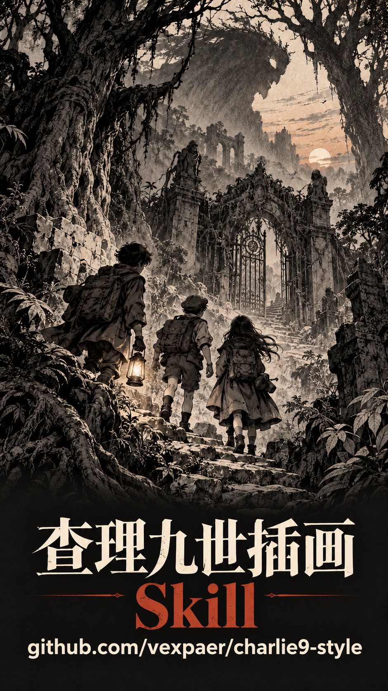
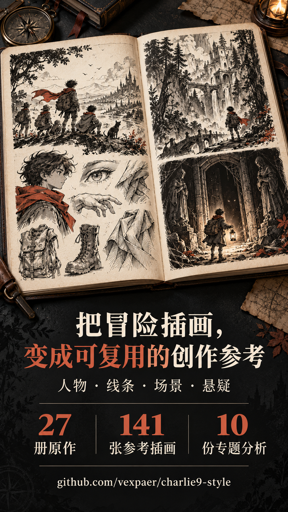

<div align="center">

# Charlie9 Style

**A reusable visual reference for expressive youth-adventure illustration.**

A Codex Skill and traceable reference collection built from 27 scanned Charlie 9 volumes.<br>
Monochrome storytelling · Character design · Environments · Photo-to-illustration

[简体中文](README.md) · **English**

[Quick start](#quick-start) · [Examples](#examples) · [Reference gallery](references/gallery.html) · [Skill guide](SKILL.md)

</div>

## Promo posters

<p align="center">
  <a href="promo/charlie9-style_skill_promo_poster.png"></a>
  &nbsp;&nbsp;
  <a href="promo/charlie9-style_skill_promo_02_repo_intro.png"></a>
</p>

## Examples

<p align="center">
  <a href="examples/gallery.jpg"></a>
</p>

<p align="center"><sub>Top: characters · creature encounter / Bottom: lakeside scene · photo-to-illustration</sub></p>

All four examples are shown in full, arranged in two rows using their original proportions. Display height is set to 560 px, with width following the aspect ratio. Click for the larger image.

[Characters](examples/characters.png) · [Creature encounter](examples/creature-encounter.png) · [Lakeside scene](examples/lakeside.png) · [Basketball court comparison](examples/basketball-court-comparison.png)

## What you can do

- **Create new illustrations:** turn recurring visual traits into practical direction for youth adventure, mystery scenes, character vignettes, and environments.
- **Study the style visually:** browse 141 traceable reference crops alongside 10 focused analyses of linework, shading, composition, and more.
- **Illustrate a photograph:** retain its perspective and subject placement while expressing the scene through contours, hatching, and black-and-white values.
- **Trace each reference:** connect crops to their source volume, book title, and PDF page.

The Skill supplies instructions and reference images. An image generation tool performs the drawing; this project includes no trained weights or standalone generation service.

## Quick start

Send this to your agent:

```text
Use https://github.com/vexpaer/charlie9-style to generate an image of xxx.
```

For example:

```text
Use https://github.com/vexpaer/charlie9-style to generate a monochrome illustration of three young explorers discovering a faint glow on a misty lake.
```

For photo-to-illustration, attach your photo and send:

```text
Use https://github.com/vexpaer/charlie9-style to illustrate this photo in black and white. Preserve the original composition and the positions of the people.
```

Your agent needs access to the repository contents and image generation capabilities.

## Style guide

| Direction | Focus | Notes |
| --- | --- | --- |
| Characters | Readable expressions, gestures, distinct silhouettes | [Character design](analysis/character-design.md) |
| Lines and values | Varied contours, selective hatching, strong black-and-white shapes | [Linework](analysis/linework.md) · [Shading](analysis/shading.md) |
| Settings | Depth layers, perspective, natural and architectural detail | [Composition](analysis/composition.md) · [Perspective](analysis/perspective.md) · [Environments](analysis/environment.md) |
| Adventure and mystery | Scale contrasts, concealment, silhouettes, unusual forms | [Creature design](analysis/creature-design.md) · [Suspense](analysis/horror-language.md) |
| Color | Treatments selected from relevant references | [Color](analysis/color.md) |

Start with [core traits and evidence limits](analysis/style-core.md), then read the notes relevant to your image.

## Skill contents

| Resource | Purpose |
| --- | --- |
| [SKILL.md](SKILL.md) | Art direction and reference entry point |
| [Style notes](analysis/) | 10 focused guides covering characters, linework, values, environments, and more |
| [Reference gallery](references/gallery.html) | 141 selected reference images |
| [Source notes](references/sources.md) | Volume, book title, and PDF page for each reference |
| [Examples](examples/) | Four showcased examples and the README collage |

```text
charlie9-style/
├── SKILL.md
├── analysis/
├── references/
│   ├── representative/
│   ├── gallery.html
│   └── sources.md
├── examples/
├── README.md
├── README.en.md
├── LICENSE
└── THIRD_PARTY_NOTICES.md
```

Download the HTML reference gallery and open it in a browser. This repository contains the Skill, necessary reference resources, and presentation documentation.

## Contributing

Reproducible bug reports, provenance corrections, evidence-based style notes, and example improvements are welcome. Include file paths, source volume, and PDF page for reference issues. Discuss substantial structural changes first.

Preserve provenance for new references. Describe the references and generation method for new examples. Keep both language editions in sync when updating documentation.

## Sources and licensing

This project studies visible illustration traits in scanned Charlie 9 samples. It does not establish illustrator attribution or a uniform style across every volume, and is not an official project.

Code and original documentation are released under the [MIT license](LICENSE). Reference scans, photographs, and generated examples are excluded from this software license. Scans and reference crops belong to their respective rights holders. See [third-party notices](THIRD_PARTY_NOTICES.md) for details.
