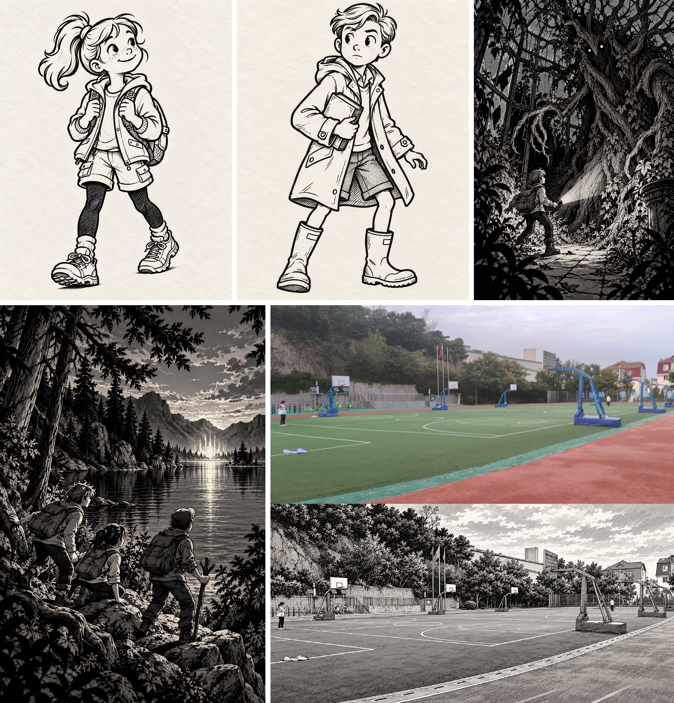

<div align="center">

# Charlie9 Style

**把少年冒险插画的线条、人物与叙事空间，变成可复用的创作参考。**

从 27 册《查理九世》扫描资料中整理出的视觉参考集与 Codex Skill。<br>
黑白叙事插画 · 人物设计 · 环境构图 · 照片转插画

**简体中文** · [English](README.en.md)

[快速使用](#快速使用) · [生成示例](#生成示例) · [参考图集](reports/representative-gallery.html) · [风格指南](SKILL.md)

</div>

## 生成示例

<p align="center">
  <a href="reports/style-tests/readme-gallery.jpg"></a>
</p>

<p align="center"><sub>上排：人物插图 · 生物遭遇　／　下排：湖边场景 · 照片转插画</sub></p>

四张示例保留完整画面，按原始比例拼成两行。展示高度设为 560 px，宽度随比例计算；点击拼图查看大图。

[人物插图](reports/style-tests/batch-02/06-07-montage.png) · [生物遭遇](reports/style-tests/03-creature-encounter.png) · [湖边场景](reports/style-tests/batch-02/03-lakeside-glow.png) · [篮球场对比](reports/style-tests/basketball-court-comparison.png)

## 这个项目能做什么

- **辅助画新图**：把少年冒险、悬疑场景、人物小图和环境插画的视觉特点转成可执行的创作方向。
- **用图片理解风格**：141 张有来源记录的代表裁图，配合线稿、明暗、构图等 10 份专题分析。
- **把照片转为插画**：保留场景的透视和主体位置，用黑白轮廓、排线与阴影重新表达。
- **追溯参考来源**：通过册数、PDF 页码和裁切坐标，连接参考图与原始扫描页。

Skill 提供指令和参考图片；实际绘图由图像生成工具完成。项目不包含训练权重或独立的图像生成服务。

## 快速使用

### 在当前项目里使用

用 Codex 打开包含本项目的工作区，指定 [SKILL.md](SKILL.md) 并描述你想画的内容：

```text
使用 charlie9-style/SKILL.md，画三名少年在雾中的湖边发现微光的黑白插画。
人物动作清晰，保留前中后景的空间层次。
```

有照片时，把照片附在请求里，说明需要保留的主体、构图和人物位置：

```text
根据这张照片，使用 charlie9-style 画一幅黑白插画。
保留场地透视、建筑位置和人物，用清晰轮廓与细密排线表现环境。
```

需要图像生成能力才能产出新图；仅阅读 Skill 时，可用它整理画面方向与提示词。

### 复用 Skill

日常创作需要以下三部分，放在同一个技能文件夹内：

```text
charlie9-style/
├── SKILL.md
├── analysis/
└── references/representative/
```

保留相对目录结构，确保 Skill 中的图片与专题链接可用。原始 PDF、完整页面渲染和候选裁图不需要用于日常绘图。

## 风格指南

| 方向 | 创作重点 | 详细说明 |
| --- | --- | --- |
| 人物 | 易读的表情、动作与不同体型轮廓 | [人物设计](analysis/character-design.md) |
| 线条与明暗 | 粗细变化、局部排线、明确的黑白块面 | [线稿](analysis/linework.md) · [明暗](analysis/shading.md) |
| 场景 | 前中后景、透视、自然与建筑细节 | [构图](analysis/composition.md) · [透视](analysis/perspective.md) · [环境](analysis/environment.md) |
| 冒险与悬疑 | 尺度反差、遮挡、剪影与异常形态 | [怪物设计](analysis/creature-design.md) · [悬疑表达](analysis/horror-language.md) |
| 色彩 | 根据具体参考选择处理方式 | [色彩](analysis/color.md) |

先读 [核心风格与证据范围](analysis/style-core.md)，再按任务选择专题。

## 参考集与处理方法

| 内容 | 数量 |
| --- | ---: |
| 扫描资料 | 27 册 / 5,667 页 |
| 含插画页面 | 2,424 页 |
| 自动裁切候选 | 3,660 张 |
| 去重后各组最佳候选 | 2,348 张 |
| 视觉复核候选 | 406 张 |
| 代表参考图 | 141 张：108 场景 / 26 人物小图 / 7 前置页 |

处理顺序：**300 DPI 页面渲染 → 联系表视觉审阅 → 候选裁切 → 排序去重 → 分层复核 → 参考图与风格分析**。

全部 5,667 页通过 Codex 内置图像理解审阅，没有使用本地视觉模型。代表参考图为候选裁图的原样复制，生成示例另行存放。

- [处理报告与局限](reports/style-report.md)
- [代表图集](reports/representative-gallery.html)
- [页面索引](metadata/pages.jsonl) · [裁图索引](metadata/illustrations.jsonl) · [代表图清单](metadata/representative_references.jsonl)

HTML 图集需要下载后在浏览器打开；GitHub 文件页显示其源码。

公开仓库包含 Skill、风格分析、代表参考图、来源索引和生成示例。原始 PDF、完整页面渲染、候选裁图与中间联系表保留在本地，不随仓库发布。

## 项目结构

```text
charlie9-style/
├── SKILL.md                  # 可复用的创作指令与参考图
├── analysis/                 # 10 份风格专题
├── references/representative/ # 精选的原样裁图
├── reports/                  # 处理报告、图集与生成示例
├── metadata/                 # 来源、坐标与复核记录
├── tools/                    # 渲染、裁切、去重与图集工具
├── config/project.json       # 原始资料路径与渲染配置
└── dataset/                  # 全页渲染与候选裁图
```

### 重建页面渲染

需要 Python 和你有权使用的原始 PDF。按 [config/project.json](config/project.json) 设置 `source_dir`，默认指向项目旁的 `查理九世` 目录。

在本目录用 PowerShell 7 执行：

```powershell
python -m pip install -r requirements.txt
python tools/extract/render_pages.py
```

已有页面会跳过；`--limit 50` 限制渲染页数，`--force` 重新渲染已有页面。上述命令只重建页面渲染；视觉审阅与选图流程见处理报告。

更新 README 拼图：

```powershell
python tools/analysis/build_readme_gallery.py
```

## 参与贡献

欢迎提交可复现的问题、参考来源纠错、风格分析补充和工具改进。问题报告请附文件路径、来源册与 PDF 页码；工具问题请附命令和错误信息。较大的结构调整建议先讨论。

新增参考图请保留来源记录，新增生成示例请标明使用的参考和生成方式。修改文档时同步更新中英文页面。

## 来源与许可

本项目基于《查理九世》扫描样本研究可见的插画特征，未验证具体插画作者归属，也不代表官方项目或所有卷册的统一风格。

代码与原创文档采用 [MIT 许可](LICENSE)。扫描参考图、照片与生成示例不属于该软件许可范围；扫描页和参考裁图的版权属于各自权利人。详见 [第三方资料说明](THIRD_PARTY_NOTICES.md)。
