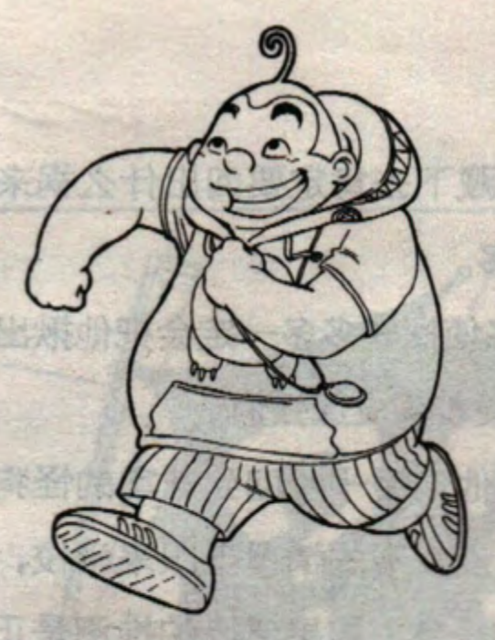
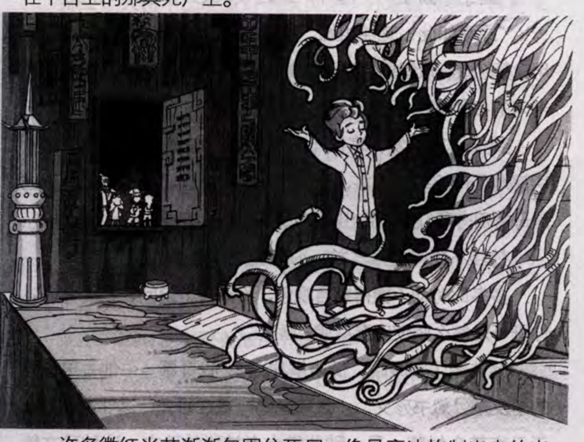
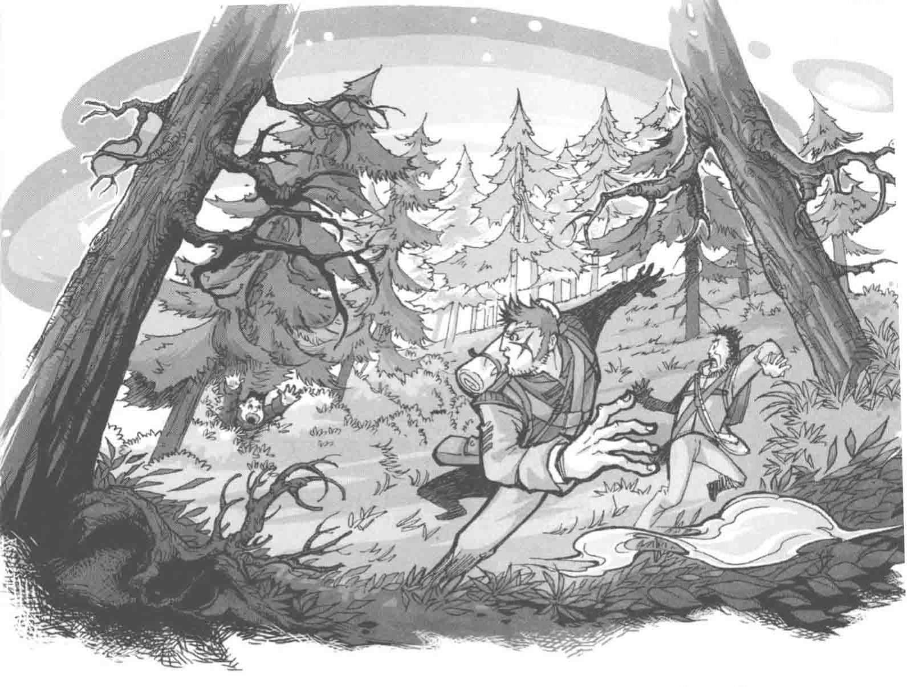

# Charlie 9 visual reference

Use this skill when creating or art-directing a new illustrated scene in the visual family shown here. The references come from scanned printed books. They show recurring traits, not a single proven artist hand or a perfectly uniform style across all volumes.

## Practical direction

- Default to a monochrome story illustration unless the user requests color. Draw lively, readable young characters with distinct silhouettes, expressive faces, and gestures that carry the action.
- Keep linework hand-drawn and varied: clear outer contours, finer interior detail, occasional crosshatching, and purposeful solid-black shapes. Let dark and light areas organize the focal point.
- Make the setting tell part of the story. Use a few strong depth planes, a clear foreground frame or diagonal, and enough architectural or natural detail to establish place without burying the characters.
- For mystery or mild horror, build suspense through silhouette, scale, concealment, an unusual creature shape, or a looming shadow. Keep the image suitable for a youth adventure story.
- Color is an optional, volume-specific treatment. If requested, use confident, clearly separated color groups; do not assume every interior illustration is fully colored.
- Make a clean new illustration. Do not reproduce printed dialogue, captions, page borders, logos, book titles, or scanning flaws from these samples. Leave text out unless the user asks for it.
- Describe visible traits rather than assigning the corpus to a named illustrator: the review did not verify creator attribution.

## Visual examples

Character vignette: rounded silhouette, clear gesture, and an expressive face. Volume 1, PDF page 42.

Story scene: an oversized, curling threat contrasts with a small human figure. Volume 7, PDF page 140.

Story scene: foreground trees frame the fleeing group and pull the eye into the forest. Volume 23, PDF page 10.

The images are unaltered reference crops from scans; some retain printed page text or scan texture. Study their drawing and staging, not those page artifacts.

## Supporting notes

Read only the notes relevant to the requested image:

- [Core style summary and evidence limits](analysis/style-core.md)
- [Character design](analysis/character-design.md)
- [Linework](analysis/linework.md)
- [Shading and value](analysis/shading.md)
- [Composition](analysis/composition.md)
- [Perspective](analysis/perspective.md)
- [Environments](analysis/environment.md)
- [Creature design](analysis/creature-design.md)
- [Suspense and horror](analysis/horror-language.md)
- [Color](analysis/color.md)
- [Representative gallery](reports/representative-gallery.html)
- [Corpus method and limitations](reports/style-report.md)
