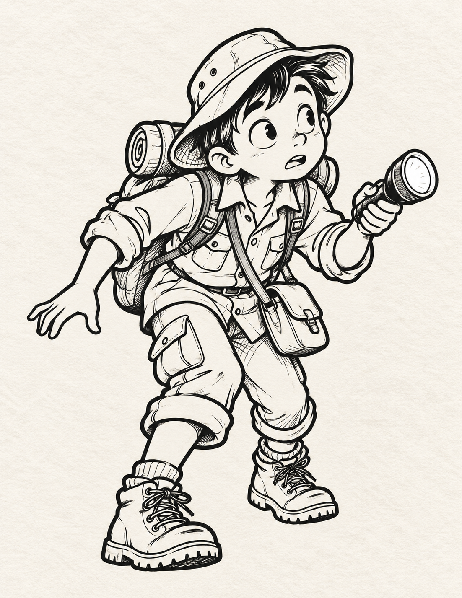
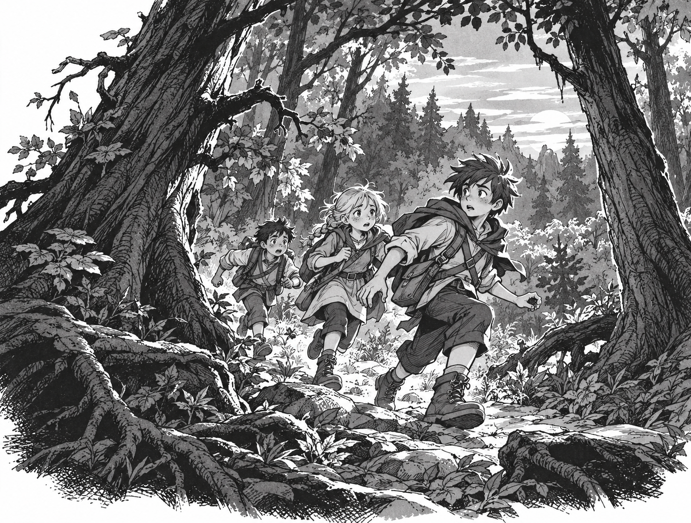
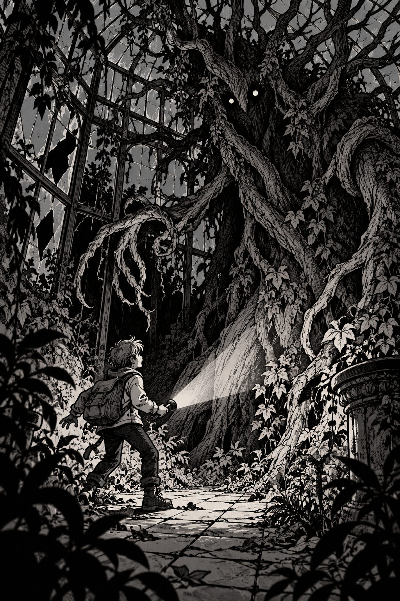

# Style test images

The three selected examples are displayed in the [project README](../../README.md): the second batch's lakeside scene 3, a side-by-side montage of characters 6 and 7, and the creature-encounter image below.

Three new illustrations generated with the built-in image-generation tool using selected corpus crops as visual references. The references guided linework, contrast, and staging; the generated characters and scenes are new.

## 1. Character vignette

Prompt focus: one original young explorer with a flashlight, full-body silhouette, expressive face, monochrome ink, and a plain light background.

## 2. Forest adventure

Prompt focus: three original young explorers hurrying through a dense forest, with foreground tree trunks, readable action, and layered depth.

## 3. Creature encounter

Prompt focus: one explorer confronting a towering bark-textured creature in an overgrown glasshouse; use high-contrast shadows and keep the suspense suitable for younger readers.

These are style experiments, separate from the scanned reference corpus. No text, logos, or page layout were requested.

## Second batch

[Open seven additional samples](batch-02/README.md): three lakeside scenes guided by the third image above, followed by four character illustrations, including two group portraits.
