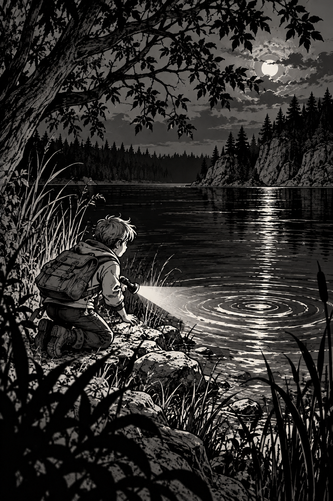
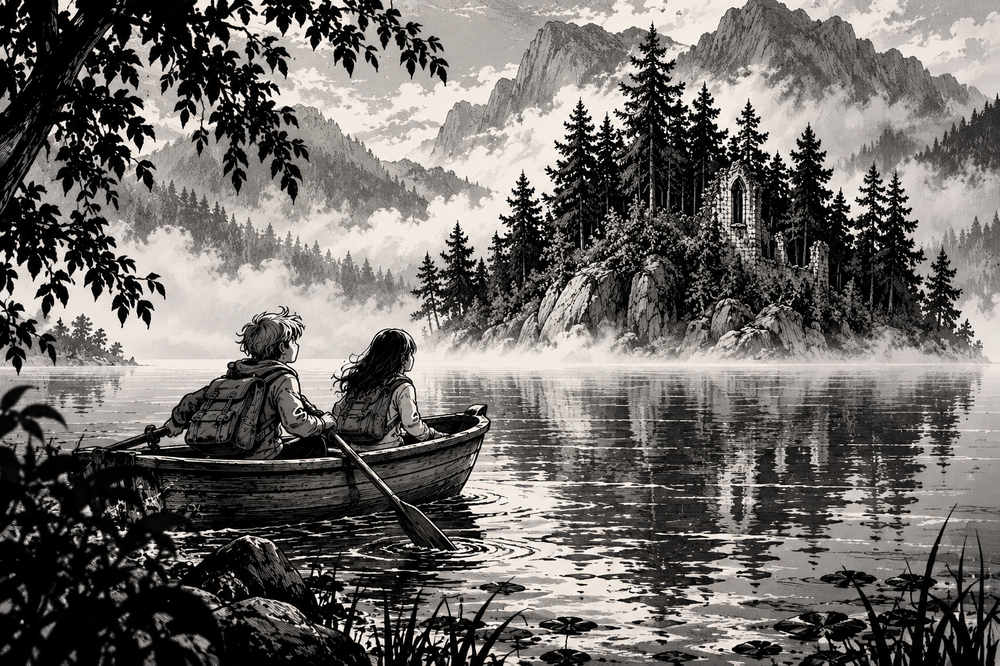
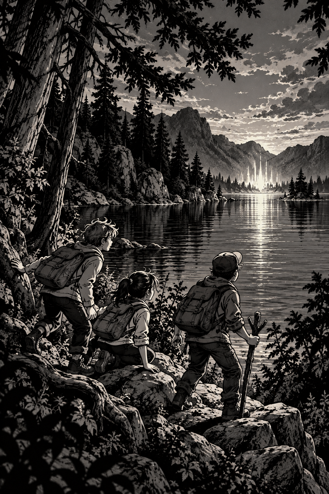
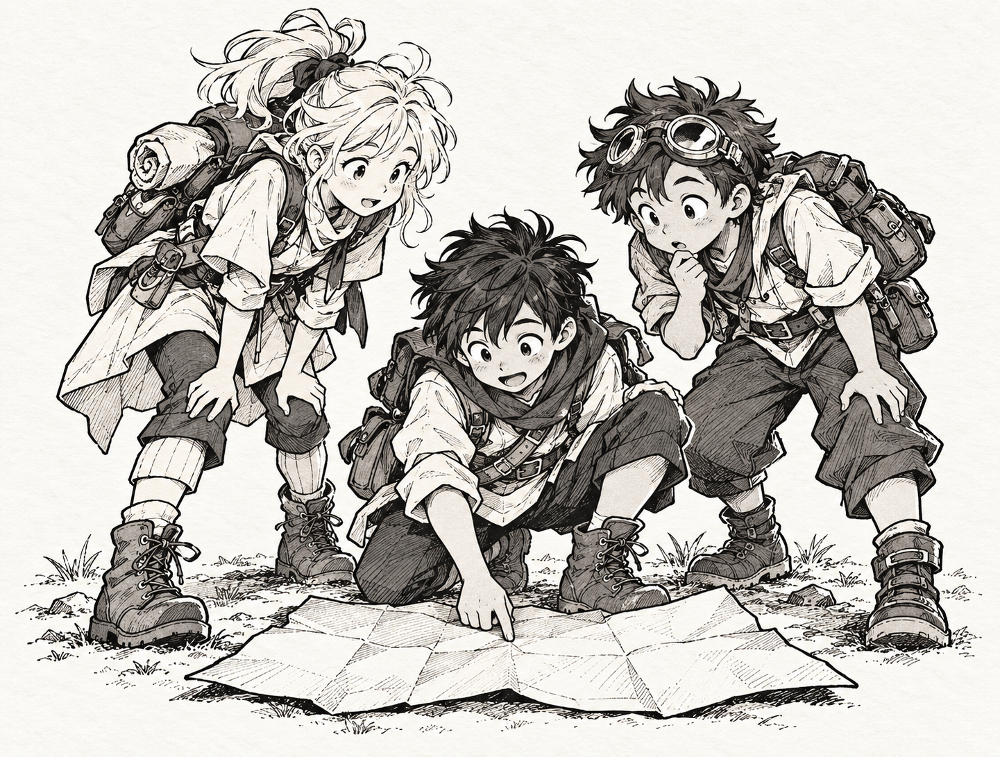
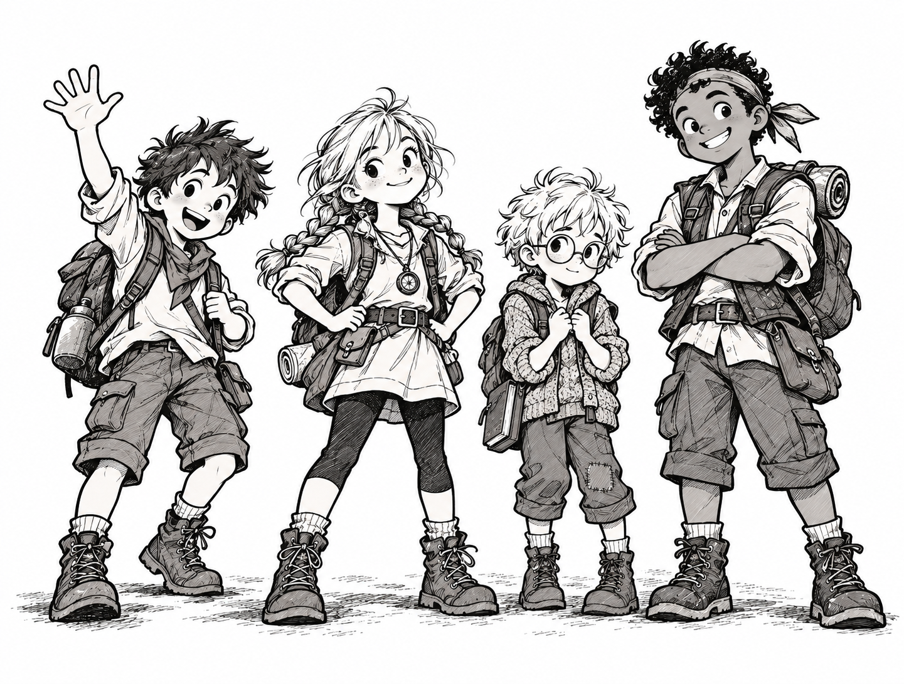
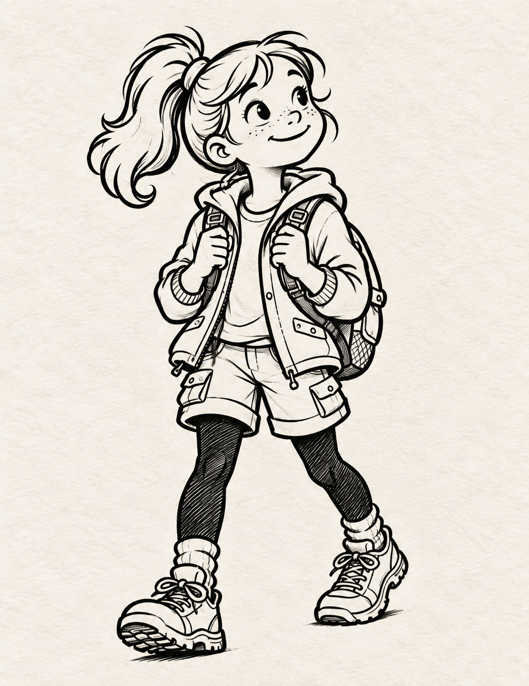
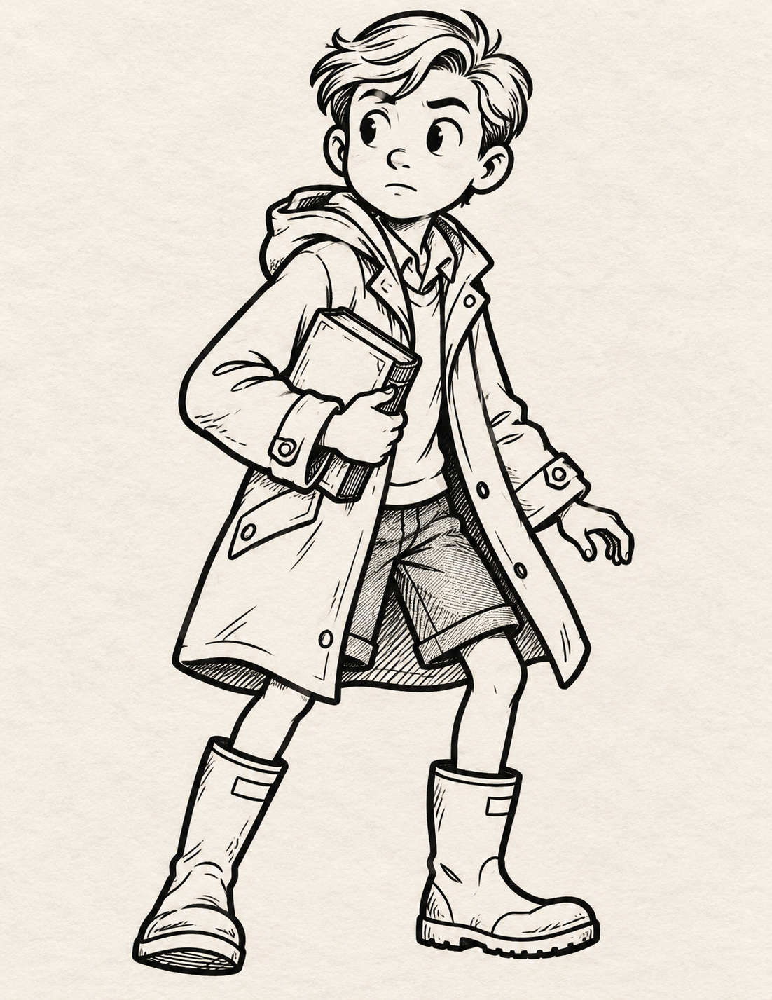

# Style test images — batch 2

The first three images use the previous creature-encounter sample as a style reference, adapting its monochrome contrast and inked atmosphere to lakeside scenes. The next four are character illustrations; the first two are group portraits.

## People at the lake

### 1. Investigating the ripples

### 2. Rowboat in the mist

### 3. Light across the lake

## Character illustrations

### 4. Three investigators with a map — group portrait

### 5. Four-person adventurer team — group portrait

### 6. Scout

### 7. Cautious reader

All seven are new generated images. The scan references were used for visual guidance only and were not changed.
